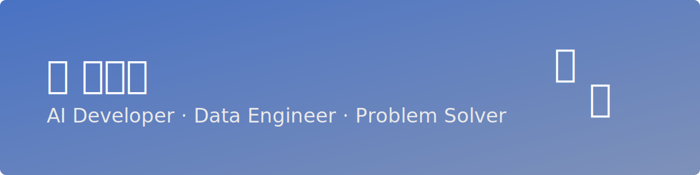

# 김서현(Seohyeon Kim) 

AI 와 데이터를 이용하여 프로젝트를 진행했습니다. 
Azure, Flask, RAG, LSTM 등 다양한 기술을 활용해 문제를 정의하고 적절한 솔루션을 설계합니다.

---

## 간단한 자기소개
**최종 학력:** 부산대학교(Pusan National University) 
**전공:** 독어독문학과 / **부전공:** 미디어커뮤니케이션
**참여 프로그램:** Microsoft AI School 7기(25.04~25.09)

---
## 📘 주요 프로젝트

| 프로젝트 | 분야 | 핵심 기술 |
|-----------|--------|------------|
| ⚡ [전력 수요량 예측 시스템](./projects/power_demand_forecast.md) | 시계열 예측 | Azure ML, LSTM |
| 💬 [해외 영수증 기반 RAG 모델](./projects/receipt_analyzer.md) | NLP / Document AI | Flask, Azure OpenAI, Document Intelligence |
| 🤖 [AI 면접 솔루션 JobAI](./projects/jobai.md) | Generative AI | React Native, Azure OpenAI, Prompt Engineering |

---

## 🧠 기술 스택

**Languages:** Python, JavaScript  
**Frameworks:** Flask, Django REST, React Native  
**AI/ML:** Azure ML, OpenAI, TensorFlow, Scikit-learn  
**Data & Cloud:** Azure Cognitive Services, Blob Storage, AI Search, Document Intelligence
**Version Control:** Github, Fork

---

## 🏅 수상 및 자격증
- Microsoft AI School 7기 Final Project **장려상 수상**
- Microsoft Certified Fundemantals AI-900 보유
- TOEIC Speaking - AL(170점) 보유
- Goethe Zertifikat - B1 보유 
---

## 📫 Contact
- 📧 Email: windykim96@gmail.com  
- 🌐 GitHub: [github.com/kimseohyun](https://github.com/kimseohyun)  
- 💼 LinkedIn: [linkedin.com/in/kimseohyun](https://linkedin.com/in/kimseohyun)  
