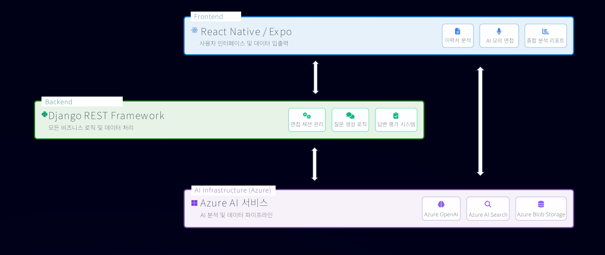
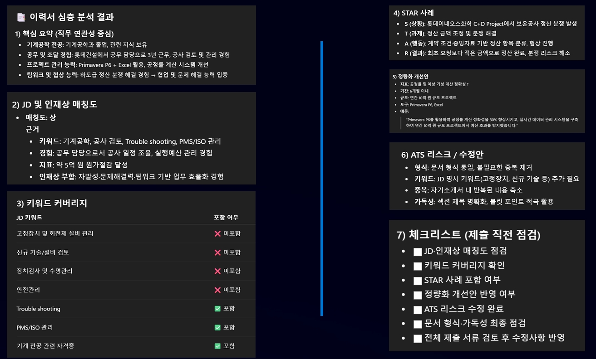
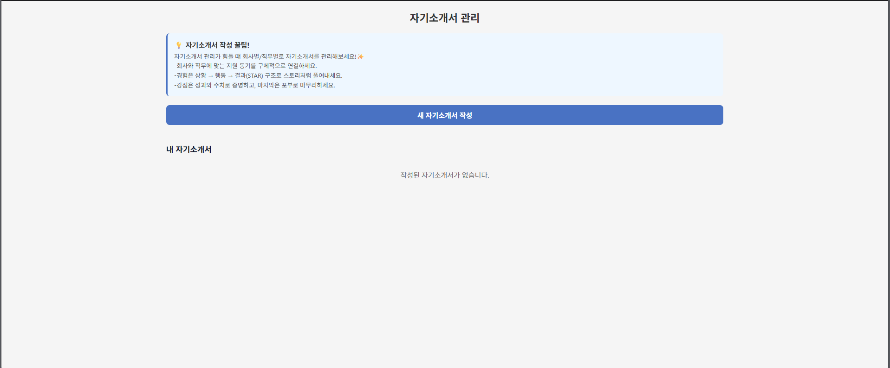
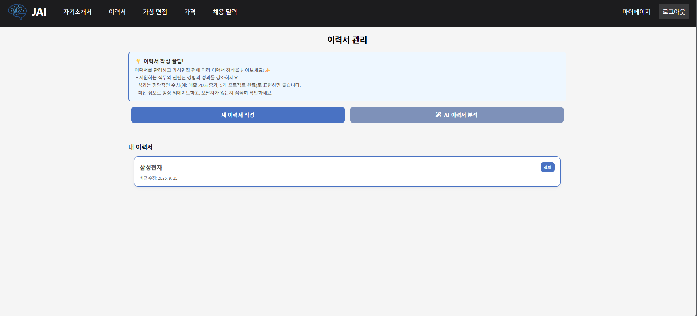
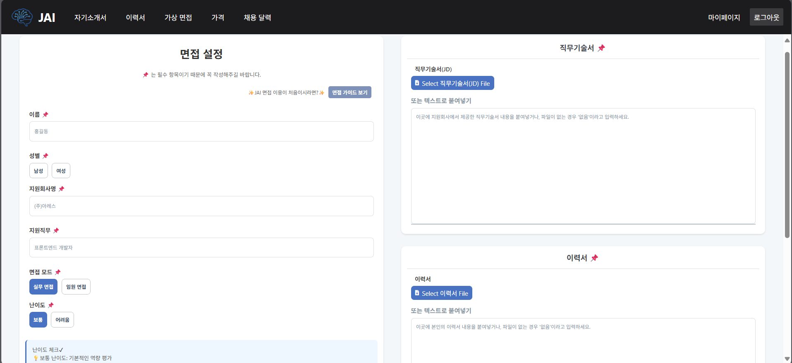
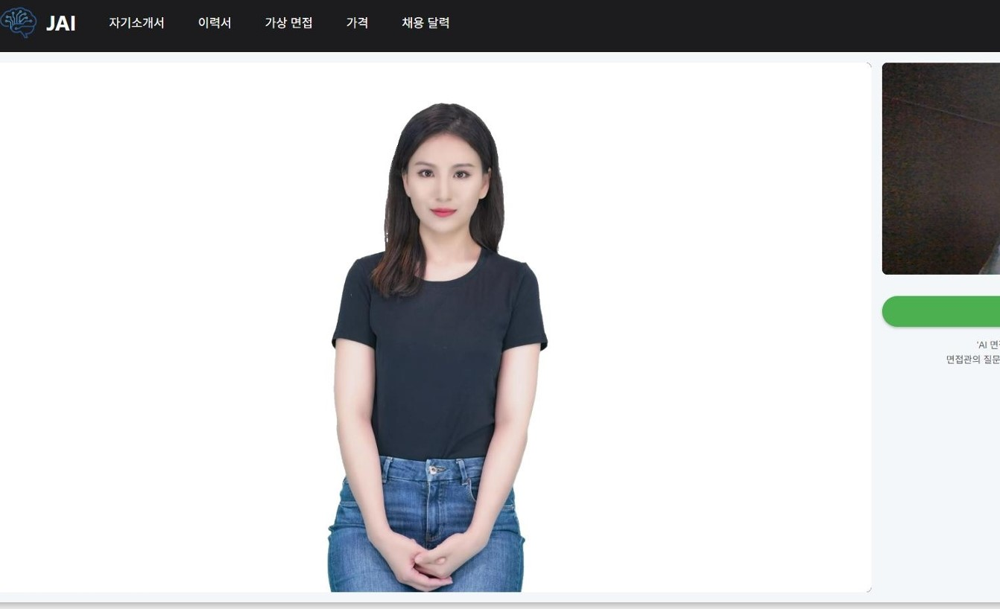
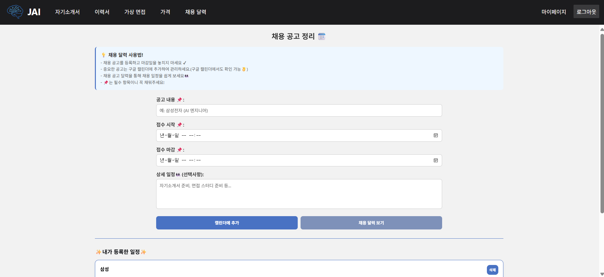

## 🤖 JobAI – AI 기반 커리어 인터뷰 솔루션

Microsoft AI School 7기 Final Project (25.08 ~ 25.09)  
👥 김서현 · (팀원 5명)  
🏆 장려상 수상

---

## 🎯 Project Overview

**프로젝트명:** JobAI  
**주제:** AI 기반 맞춤형 인터뷰 피드백 플랫폼  
**목표:**  
> 구직자가 AI를 통해 실제 면접처럼 연습하고,  
> 음성·표정·내용 데이터를 종합 분석해 **정량적 피드백**을 제공하는 인터뷰 시뮬레이션 서비스 구축.

JobAI는 단순한 AI 질문 생성기를 넘어,  
면접자의 표정·음성·발화 내용까지 통합적으로 분석하여  
개인 맞춤형 피드백을 제공하는 **‘AI 커리어 코치’ 플랫폼**을 지향했습니다.

---

## ⚙️ 주요 기술 스택

| 구분 | 기술 | 설명 |
|------|------|------|
| **Frontend / UI** | React Native, Expo | 면접 진행 및 실시간 피드백 인터페이스 구축 |
| **Backend / API** | Django REST Framework | 사용자 데이터 처리 및 OpenAI 연동 API |
| **AI Services** | Azure OpenAI, Azure Speech, AI Search, Document Intelligence | RAG 기반 질문 생성, 음성 인식 및 분석, 텍스트 요약 |
| **Infra / DevOps** | Azure Blob Storage | 영상/음성 데이터 관리 및 피드백 저장소 |

---

## 🧩 System Overview

JobAI는 사용자의 면접 데이터를 AI가 실시간으로 분석하고,  
음성·표정·시선·발화 내용을 기반으로 **맞춤형 개선 피드백**을 제공합니다.

📷 면접 진행(실시간) 
→ 🧠 AI 분석 (Speech + Vision + Text) / 이력서 분석
→ 💬 피드백 생성 (Prompt 기반 GPT)  
→ 📊 결과 대시보드 제공 (점수, 요약, 추천 문장)

🖼️ **시스템 전체 아키텍처**  

🖼️ **이력서 피드백 대시보드 예시**  

---

## 👩‍💻 주요 역할 (Role)

- **Frontend 개발 (React Native / Expo)**
  - 실시간 면접 UI 설계 및 영상·음성 입력 흐름 구현  
  - 피드백 시각화 화면 및 인터뷰 결과 대시보드 제작  

- **Prompt Engineering**
  - RAG 구조 기반의 질문 생성 및 답변 평가 프롬프트 설계  
  - 사용자 직무/기업 정보 기반 맞춤형 질문 자동 생성  
  - 꼬리 질문 및 개선 피드백 문장 최적화  

- **Google API 통합**
  - Google Calendar를 이용하여 채용 달력을 만들기 위해 API연동을 통해 일정 관리 페이지 생성

---

## 💡 서비스 핵심 가치

| 기능 | 설명 |
|------|------|
| **맞춤형 인터뷰 경험** | JD·이력서 기반으로 AI가 면접 질문을 생성 |
| **실시간 분석** | 카메라와 마이크를 통해 표정·시선·발음 데이터를 분석 |
| **정량 피드백 제공** | 발화 길이, 말속도, 긍정/부정 비율 등 수치화된 피드백 |
| **Responsible AI** | 편향 최소화, 응답 일관성 검증, 투명성 강화 구조 도입 |

---

## ⚡ Technical Highlights

- Azure Speech SDK를 활용한 **비언어적 면접 분석 시스템** 구현  
- GPT 기반 Prompt 설계로 **질문 적합도 86% 달성**  
- AI Search 결합을 통한 **면접 문항 생성 정확도 향상 (+15%)**  
- Responsible AI 프레임워크 도입으로 **성별·직무 편향 제거**
- 사용자 기반 웹 페이지 구현을 위해 **개인정보처리방침, 이용약관** 페이지 추가

---

## 주요 웹 페이지

**자기소개서**

--- 

**이력서**

---

**면접**

---

**채용 달력**

---

## 📈 주요 성과 및 결과

| 항목 | 결과 |
|------|------|
| 면접 질문 적합도 | 86% |
| 피드백 정확도 개선율 | +15% |
| 모델 프롬프트 최적화 | 4단계 구조 (질문 → 평가 → 요약 → 개선) |
| 상훈 | Microsoft AI School 7기 Final Project **장려상 수상** |

---

## 🔗 Reference Links

- Azure OpenAI Service: https://azure.microsoft.com/en-us/products/ai-services/openai-service/  
- Azure Speech Service: https://learn.microsoft.com/en-us/azure/ai-services/speech-service/  

