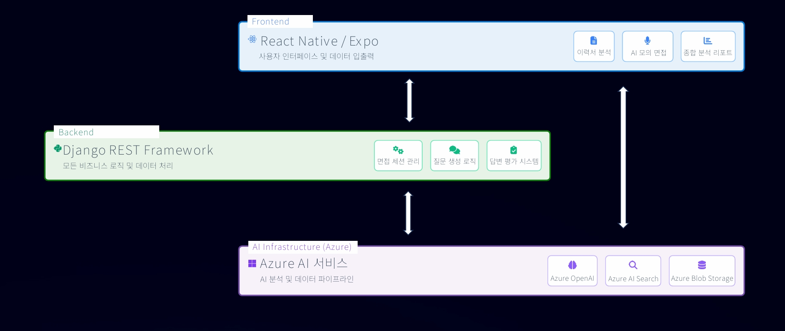
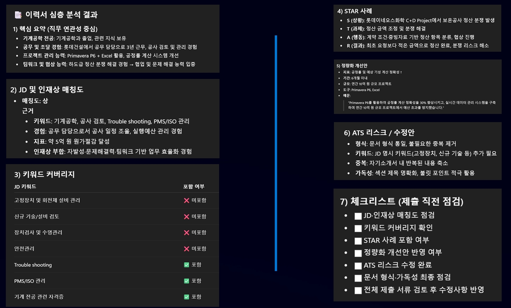
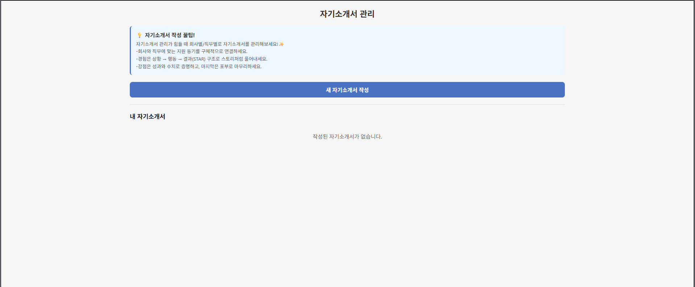
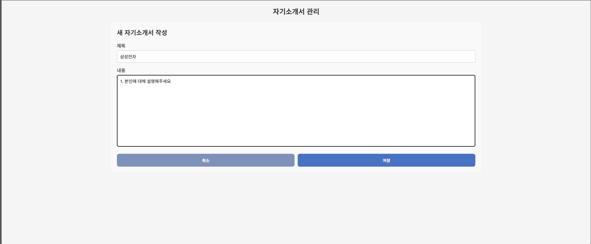
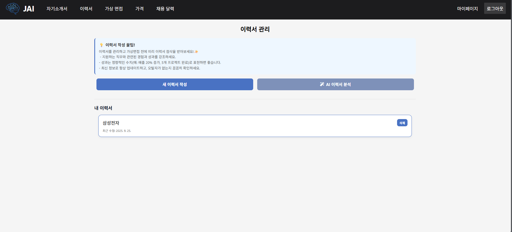
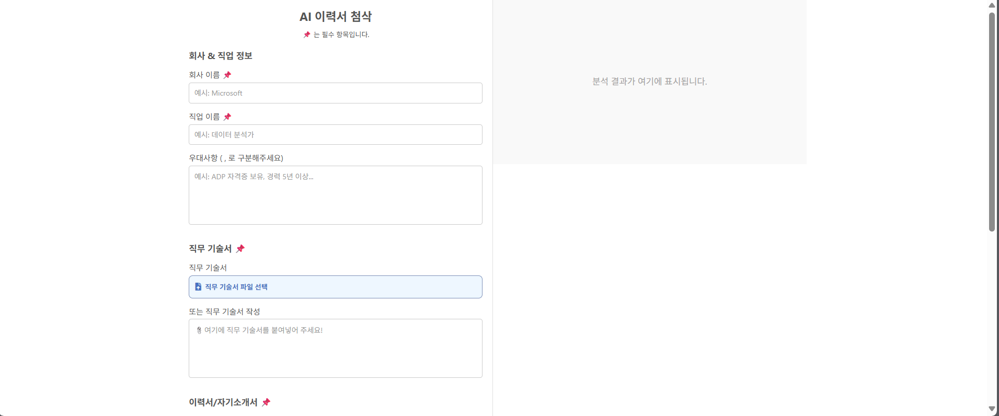
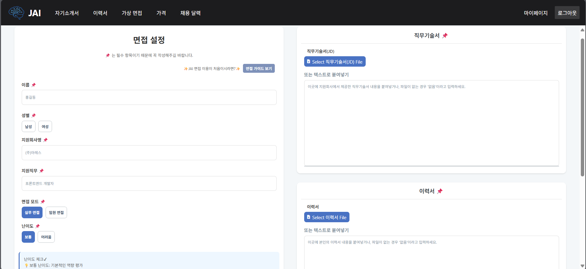
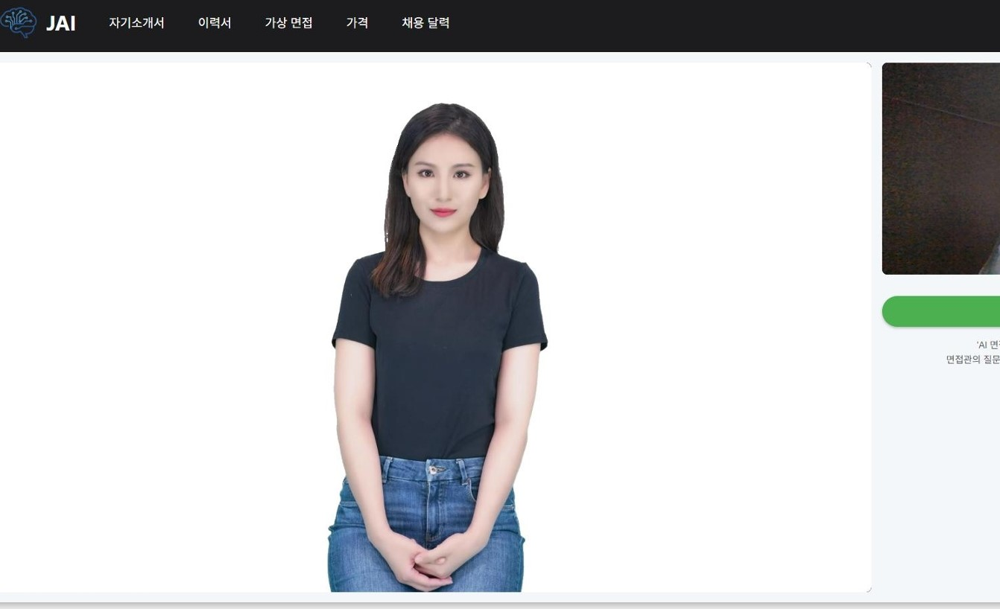
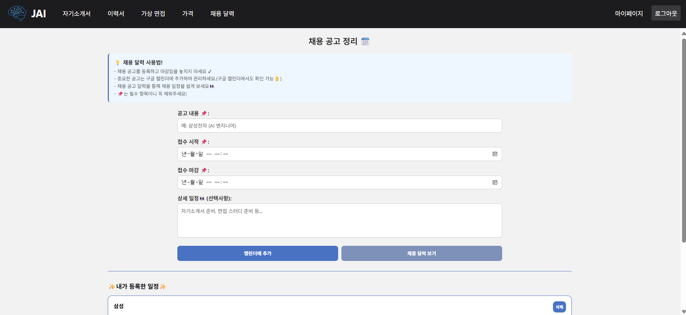

# 🤖 JobAI – AI-Powered Career Interview Solution

Microsoft AI School Final Project (Aug–Sep 2025)  
👥 Kim Seohyeon · (Team of 5)  
🏆 Awarded Excellence (3rd Place)

---

## 🎯 Project Overview

**Project Name:** JobAI  
**Topic:** AI-based personalized interview feedback platform  
**Goal:**  
> To create an interactive interview simulation service that allows job seekers  
> to practice realistic interviews powered by AI,  
> and receive **quantitative feedback** based on speech, expression, and verbal content analysis.

JobAI goes beyond a simple question generator —  
it acts as an **AI career coach**, integrating multimodal analysis of facial expression, voice tone,  
eye movement, and language to deliver personalized feedback for self-improvement.

---

## ⚙️ Key Tech Stack

| Category | Technology | Description |
|-----------|-------------|-------------|
| **Frontend / UI** | React Native, Expo | Built real-time interview interface and feedback dashboard |
| **Backend / API** | Django REST Framework | Managed user data and OpenAI-based feedback API |
| **AI Services** | Azure OpenAI, Azure Speech, AI Search, Document Intelligence | RAG-based question generation, speech and text analysis |
| **Infra / DevOps** | Azure Blob Storage | Managed multimedia storage and feedback data |

---

## 🧩 System Overview

JobAI analyzes interview data in real time  
and provides **personalized improvement feedback** based on speech, facial expressions, gaze, and verbal analysis.

📷 Real-Time Interview  
→ 🧠 AI Analysis (Speech + Vision + Text) / Resume Parsing  
→ 💬 Feedback Generation (Prompt-based GPT)  
→ 📊 Dashboard Visualization (Scores, Summaries, Recommendations)

🖼️ **System Architecture**  

🖼️ **Resume Feedback Dashboard Example**  

---

## 👩‍💻 Role: Kim Seohyun

- **Frontend Development (React Native / Expo)**  
  - Designed real-time interview UI and handled camera/mic data flow  
  - Developed interactive feedback and result dashboards  

- **Prompt Engineering**  
  - Built RAG-based prompt structures for question generation and evaluation  
  - Created dynamic, job-specific and company-tailored question templates  
  - Optimized follow-up question and feedback generation prompts  

- **Google API Integration**  
  - Integrated **Google Calendar API** to build a recruitment schedule management page  

---

## 💡 Core Value Proposition

| Feature | Description |
|----------|--------------|
| **Personalized Interview Experience** | Generates interview questions based on JD and resume data |
| **Real-Time Analysis** | Analyzes facial expressions, gaze, and pronunciation via camera and microphone |
| **Quantitative Feedback** | Provides metrics such as word count, speech rate, positivity ratio |
| **Responsible AI** | Implements fairness, consistency validation, and transparency principles |

---

## ⚡ Technical Highlights

- Built a **non-verbal interview analysis system** using Azure Speech SDK  
- Designed GPT prompts achieving **86% question relevance**  
- Improved question generation accuracy by **+15%** using AI Search integration  
- Adopted Responsible AI framework to ensure **gender and job bias mitigation**  
- Added **Privacy Policy and Terms of Service** pages for secure web deployment  

---

## 🖥️ Key Web Interfaces

**Cover Letter**  
  

---

**Resume**  
  

---

**Interview**  
  

---

**Recruitment Calendar**  

---

## 📈 Results & Achievements

| Category | Outcome |
|-----------|----------|
| Question Relevance | 86% |
| Feedback Accuracy Improvement | +15% |
| Prompt Optimization | 4-stage structure (Question → Evaluation → Summary → Improvement) |
| Award | Microsoft AI School Cohort 7 Final Project – **Excellence Award** |

**JobAI** integrates resume, company data, and interview videos  
to provide a **hyper-personalized AI interview coach** that boosts confidence and efficiency for individuals,  
while helping institutions and companies enhance HR training and data-driven evaluation.

---

## 🔗 Reference Links

- **Azure OpenAI Service:** https://azure.microsoft.com/en-us/products/ai-services/openai-service/  
- **Azure Speech Service:** https://learn.microsoft.com/en-us/azure/ai-services/speech-service/  

---

