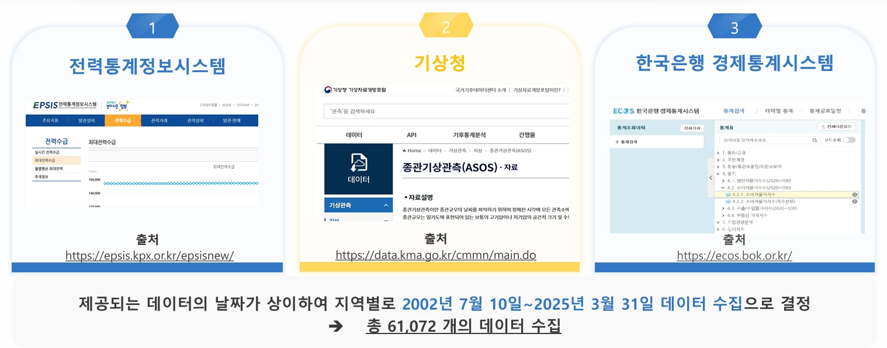
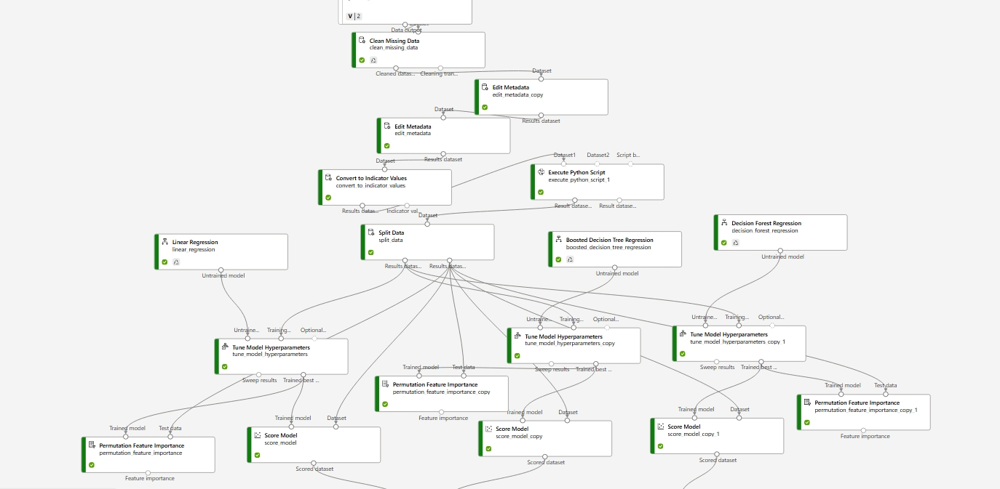

## ⚡ 공공데이터 기반 일일 최대 전력 수요 예측 모델 

Microsoft AI School 1차 프로젝트 (2024.05–06)  
👥 김서현 · (팀원 4명)
---

## 🎯 Project Overview

**주제:** 공공데이터를 활용한 일일 최대 전력 수요 예측  
**목표:** 다양한 기상 및 경제 변수를 통합 분석하여 전력 과잉생산을 줄이고,  
전력계통의 안정성과 효율성을 높이는 AI 기반 예측 모델 개발

**핵심 아이디어:**  
> “날씨·소비지수·계절 등 외부 요인을 반영한 시계열 기반 LSTM 예측모델을 통해  
> 효율적 전력 수급을 지원하고, 에너지 낭비를 최소화한다.”

---

## ⚙️ 주요 기술 및 도구

| 구분 | 도구 / 기술 | 역할 |
|------|---------------|------|
| **Data 수집** | KEPCO EPSIS, 기상청, 한국은행 ECOS API | 전력·기상·경제데이터 수집 (총 61,072건) |
| **전처리** | Pandas, Scikit-learn | 결측치·이상치 처리, CPI 환산, 정규화, 차분, VIF 확인 |
| **모델링** | Azure ML Designer, Automated ML, PyTorch | BDT, DFR, KNN, SVM, Ensemble, LSTM 비교 |
| **웹 배포** | Flask, HTML/CSS, Matplotlib | 사용자 입력 기반 예측 및 시각화 구현 |

---

## 🧩 Project Flow

1️⃣ **데이터 수집**
- 전력통계정보시스템(EPSIS)에서 지역별 전력 수요량 데이터 확보  
- 기상청·한국은행에서 날씨 및 경제지수(CPI) 데이터 수집  
- 총 61,702건으로 통합 및 기간 일치화  

🖼️ **데이터 수집 과정**  

2️⃣ **데이터 전처리**
- Rolling mean, KNN을 통한 결측치 보정  
- 다중공선성(VIF) 점검 및 변수 축소  
- 지역별 가중치 처리
- 정규화(MinMax, Z-score), 차분으로 정상성 확보  
- CPI를 반영한 실질 전기요금 변수 추가  

🖼️ **데이터 전처리 파이프라인**  

3️⃣ **모델 학습 및 평가**
- BDT, DFR, LR, SVM, KNN, Ensemble, NNR, LSTM 모델 비교  
- MAE / RMSE / R² 기준으로 성능 평가  
- BDT > Ensemble > DFR 순으로 안정적 성능 확보 (Azure Designer)
- Azure AutoML(GPU)로 딥러닝 기반 성능 개선 실험  
- Python Machine Learning / Deep Learning 모델 비교
- 최종적으로 R2: 0.72, MAE: 0.095, RMSE: 0.14의 결과를 낸 "LSTM" 모델을 선택

🖼️ **Azure ML Designer 모델 구성 화면**  

🖼️ **LSTM 모델 결과**  

4️⃣ **웹 구현**
- Flask 기반 웹페이지에서 사용자가 날짜·온도 입력  
- 사전 학습된 모델(.pkl) 불러와 예측 수행  
- 예측값, 실제값, 오차를 표와 그래프로 시각화  

---

## 👩‍💻 주된 역할 (Role)

- **데이터 전처리 및 정규화**  
  - Feature selection, VIF 점검, 이상치 처리  
  - CPI 변수 추가 및 계절 범주화  
- **모델링 협업**  
  - Azure ML Designer 환경에서 LSTM 학습 구조 실험  
  - AutoML 결과 비교 및 Feature Importance 해석  

---

## 📈 성과 및 결과

| 항목 | 내용 |
|------|------|
| 예측 정확도 | RMSE 0.1407 수준 확보 |
| 주요 개선점 | Feature Importance 기반 변수 조정으로 과적합 완화 |
| 배포 성과 | 웹 예측 플랫폼 시연 완성 (날짜 입력 → 예측 결과 시각화) |
| 책임있는 AI | 공정성: 다양한 모델 비교 / 투명성: 모델·데이터 공개 / 신뢰성: 전처리 명시 |
| 평가 | 개별 평가에서 1등을 수상 |

---

## 🔗 Reference Links

- 전력통계정보시스템 (EPSIS): https://epsis.kpx.or.kr  
- 기상청 데이터포털: https://data.kma.go.kr  
- 한국은행 ECOS: https://ecos.bok.or.kr  
- GitHub Repository: (추가 예정)

