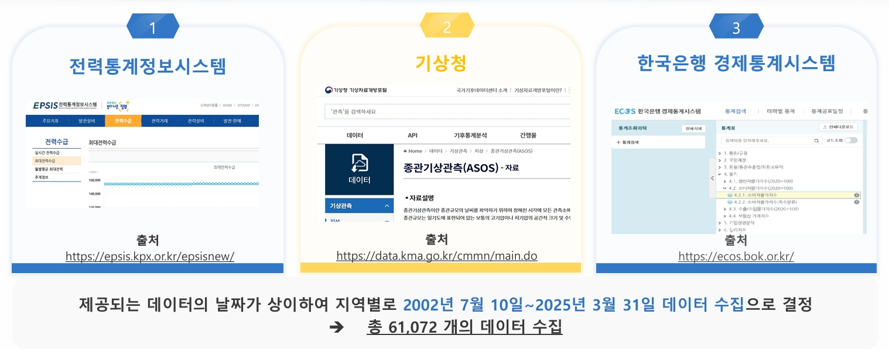
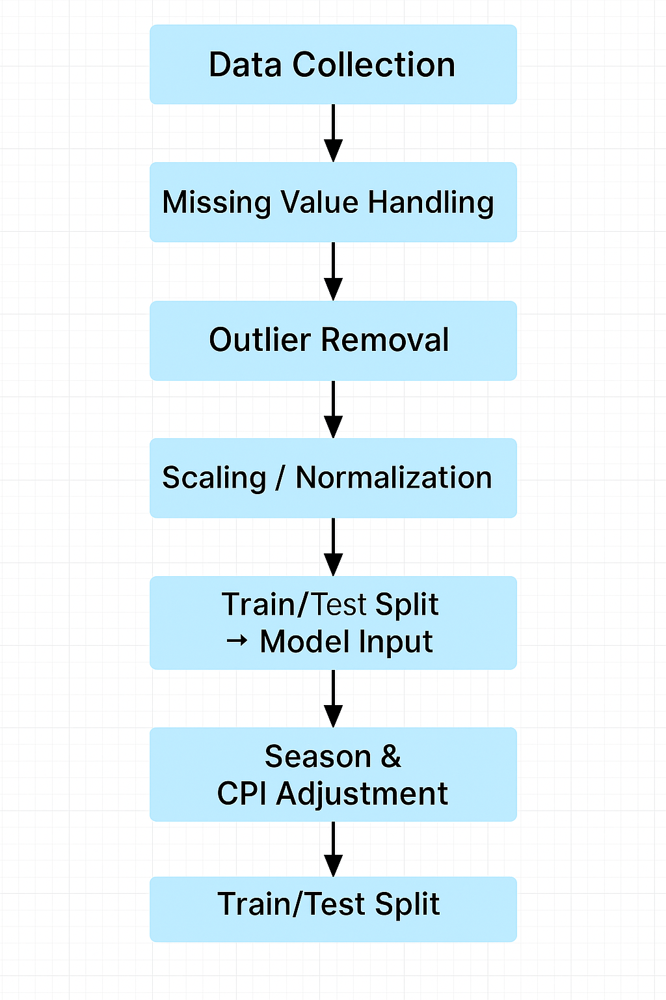
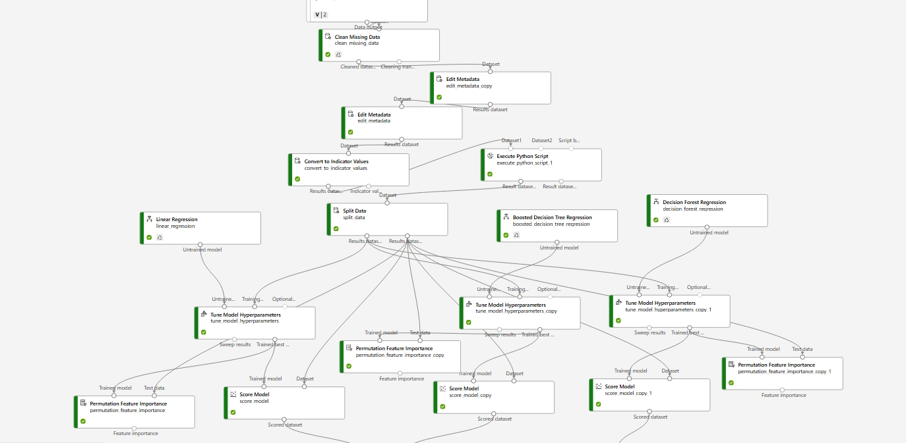
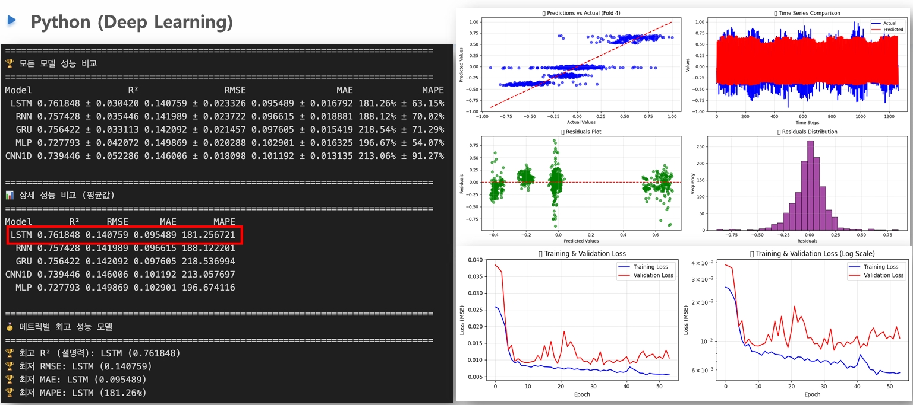

# Public Data-Based Daily Maximum Power Demand Forecasting Model

Microsoft AI School 1st Project (May–June 2024)  
👥 Kim Seohyeon · (Team of 4)
Ranked 1st in internal evaluation

---

## 🎯 Project Overview

**Topic:** Power demand forecasting using public data  
**Goal:** Develop an AI-based prediction model that integrates weather and economic indicators  
to reduce power overproduction and enhance grid stability and efficiency.

**Core Idea:**  
> “By applying an LSTM-based time series model that reflects external factors  
> such as weather, consumption index, and seasonality,  
> we aim to support efficient energy supply and minimize waste.”

---

## ⚙️ Key Tools and Technologies

| Category | Tools / Technologies | Description |
|-----------|----------------------|--------------|
| **Data Collection** | KEPCO EPSIS, KMA, Bank of Korea ECOS API | Collected electricity, weather, and economic data (61,072 records) |
| **Preprocessing** | Pandas, Scikit-learn | Missing value and outlier handling, CPI conversion, normalization, differencing, and VIF analysis |
| **Modeling** | Azure ML Designer, Automated ML, PyTorch | Compared models: BDT, DFR, KNN, SVM, Ensemble, LSTM |
| **Web Deployment** | Flask, HTML/CSS, Matplotlib | Implemented user-input-based forecasting and visualization |

---

## 🧩 Project Flow

### 1️⃣ Data Collection
- Collected regional power demand data from **EPSIS**  
- Gathered weather and CPI data from **KMA** and **Bank of Korea ECOS**  
- Integrated and time-aligned total of **61,702 records**

🖼️ **Data Collection Process**  

---

### 2️⃣ Data Preprocessing
- Imputed missing values using Rolling Mean and KNN  
- Checked multicollinearity (VIF) and reduced redundant variables  
- Applied regional weighting and normalization (MinMax, Z-score)  
- Differenced data for stationarity  
- Added real electricity cost variable adjusted by CPI

🖼️ **Data Preprocessing Pipeline**  

---

### 3️⃣ Model Training and Evaluation
- Compared models: BDT, DFR, LR, SVM, KNN, Ensemble, NNR, LSTM  
- Evaluated performance with **MAE / RMSE / R²** metrics  
- BDT > Ensemble > DFR showed stable performance in Azure ML Designer  
- Conducted AutoML experiments using GPU for deep learning performance improvement  
- Compared Python-based ML and DL models  
- Selected **LSTM** as final model with results:  
  **R² = 0.72**, **MAE = 0.095**, **RMSE = 0.14**

🖼️ **Azure ML Designer Workflow**  

🖼️ **LSTM Model Results**  

---

### 4️⃣ Web Implementation
- Built a Flask web app allowing users to input date and temperature  
- Loaded pre-trained model (`.pkl`) to generate predictions  
- Displayed actual vs. predicted values and error visualization in graphs

---

## 👩‍💻 Role: Kim Seohyeon

- **Data Preprocessing & Normalization**  
  - Performed feature selection, VIF check, and outlier handling  
  - Added CPI-adjusted variables and seasonal categorization  

- **Modeling Collaboration**  
  - Designed and tested LSTM model architecture in Azure ML Designer  
  - Analyzed AutoML results and interpreted feature importance  

---

## 📈 Results and Achievements

| Category | Description |
|-----------|--------------|
| **Forecasting Accuracy** | Achieved RMSE = 0.1407 |
| **Improvement** | Reduced overfitting via feature importance-based variable tuning |
| **Deployment** | Completed web-based prediction and visualization (input → prediction → chart) |
| **Responsible AI** | Fairness: Compared multiple models / Transparency: Data and model disclosure / Reliability: Documented preprocessing |
| **Evaluation** | Ranked 1st in individual evaluation within cohort |

---

## 🔗 Reference Links

- **EPSIS (Electric Power Statistics Information System):** https://epsis.kpx.or.kr  
- **KMA Data Portal:** https://data.kma.go.kr  
- **Bank of Korea ECOS API:** https://ecos.bok.or.kr  
- **GitHub Repository:** (To be added)