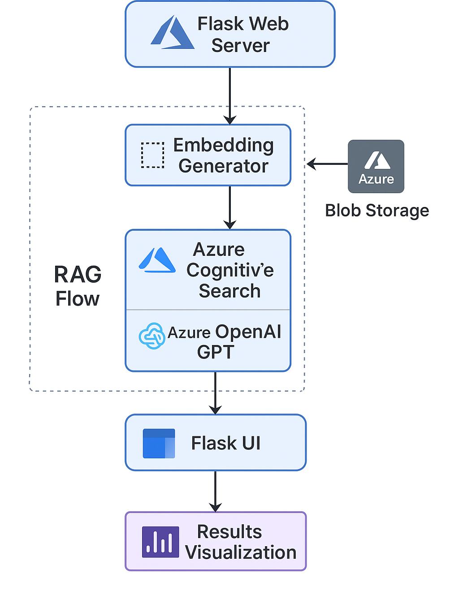
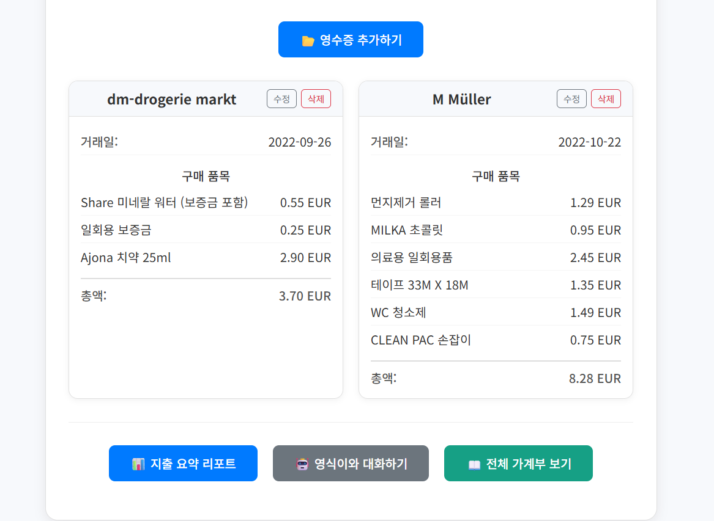
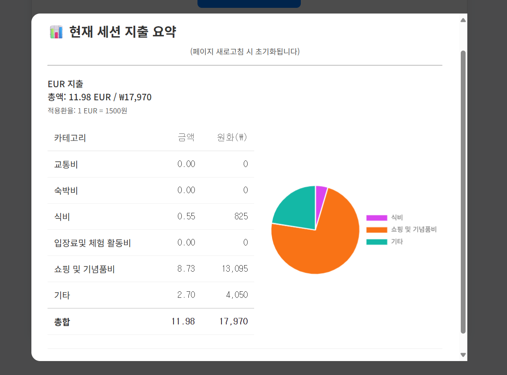
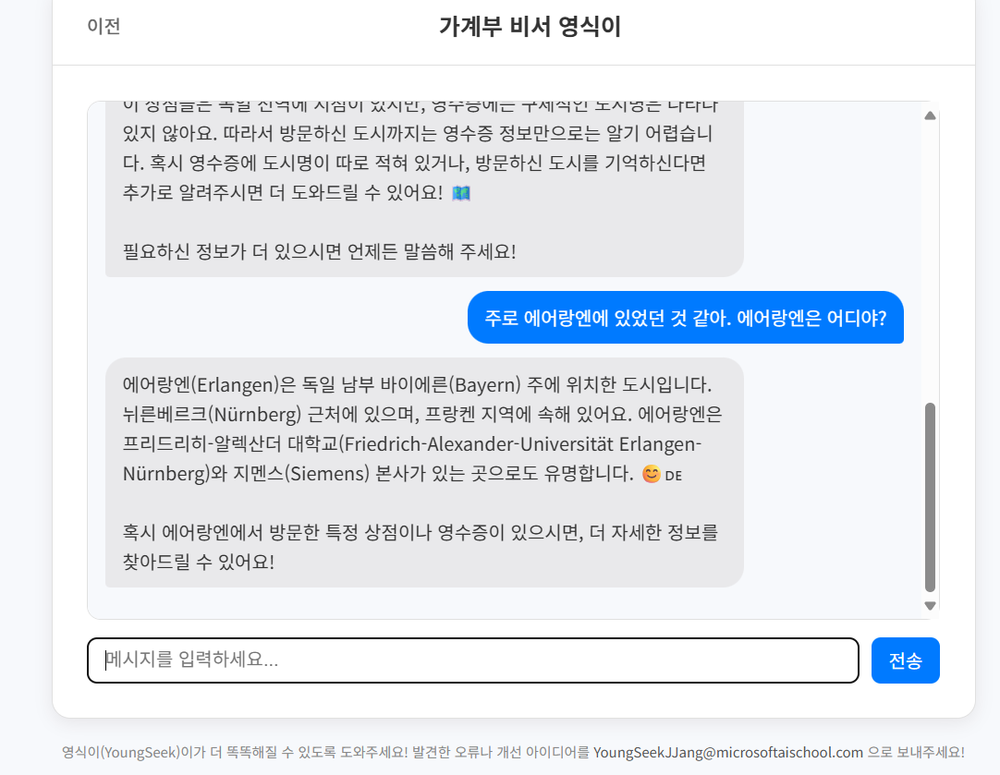
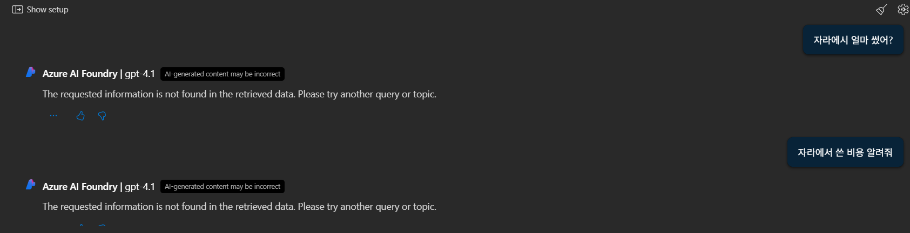
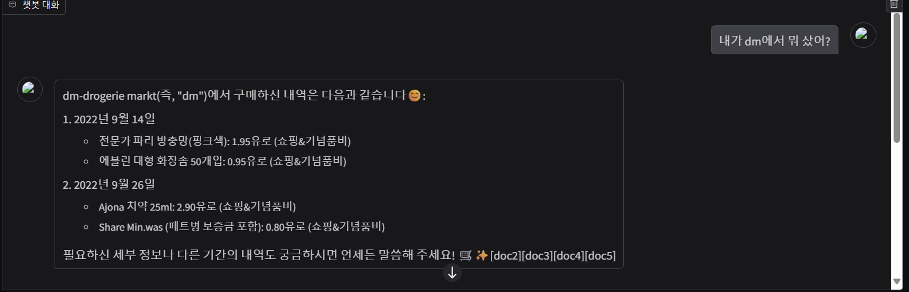

# 💬 YoungSeek (영식이) – 해외 영수증 기반 RAG 챗봇 서비스

Microsoft AI School 2차 프로젝트 (2025.07)  
👥 김서현 · (팀원 4명)

---

## 🎯 Project Overview

**프로젝트명:** YoungSeek (영식이)  
**주제:** 해외 영수증 관리 및 질의응답 서비스  
**목표:**  
> 해외 체류 중 발생하는 다양한 영수증을 자동으로 분석하고,  
> 한국어로 항목 요약 및 지출 통계 제공,  
> GPT 기반 질의응답 기능으로 재무 관리 효율성을 높이는 웹 기반 플랫폼 구축.

**기술 목표:**  
- OCR 데이터의 텍스트 인식 및 정제  
- Embedding 기반 의미 검색(RAG 구조)  
- 대화형 질의응답 시스템 구축  
- 데이터베이스 및 인덱싱 자동화  
- 사용자 친화적 UI 설계 (웹 환경)

---

## ⚙️ 주요 기술 스택

| 구분 | 기술 | 설명 |
|------|------|------|
| **Frontend / UI** | Flask, Gradio | 웹 기반 인터페이스 구성 및 테스트 |
| **Backend / API** | Django REST Framework | RAG 질의응답 API 및 데이터 연동 |
| **AI Services** | Azure OpenAI, Document Intelligence | OCR 텍스트 추출, GPT 질의응답 |
| **Search / DB** | Azure Cognitive Search, Blob Storage | 벡터 기반 검색, 데이터 저장 및 관리 |
| **ETL / Indexing** | Python + Azure SDK | 자동 인덱싱 및 Embedding 파이프라인 구축 |

---

## 🧩 System Architecture

YoungSeek은 영수증 이미지 업로드부터 GPT 질의응답까지의 흐름으로 구성되었습니다.

🖼️ **시스템 구조**  

영수증 업로드  
→ 🧾 OCR 분석 (Document Intelligence)  
→ 🔍 Embedding + Azure AI Search 인덱싱  
→ 💬 GPT 질의응답 (RAG 기반)  
→ 📊 Flask UI 출력 및 지출 리포트 시각화

🖼️ **시스템 전체 아키텍처 다이어그램**  

🖼️ **Flask 웹 화면**  

이 시스템은 사용자가 업로드한 영수증을 OCR로 분석한 뒤,  
해당 데이터를 Embedding하여 Azure Cognitive Search에 저장하고,  
RAG 기반 GPT가 질문 맥락에 따라 적절한 응답을 생성하는 구조로 동작합니다.  
즉, 데이터 처리와 검색·응답 생성을 완전히 자동화한 AI 파이프라인입니다.

---

## 👩‍💻 주요 역할 (Role)

- **RAG 파이프라인 엔지니어링**
  - Embedding 벡터 생성 및 Azure Search 인덱스 설계
  - Retrieval 성능 검증 및 Prompt 구조 최적화
- **웹 서비스 통합**
  - Flask 기반 REST API 설계 및 Django 백엔드 연동
  - GPT 질의응답 결과를 시각화하는 UI 구성 (Gradio 프로토타입 → Flask 전환)

---

## ⚡ Technical Highlights
- Azure Document Intelligence 기반 **다국어 OCR 처리**
- Azure Cognitive Search + OpenAI 결합으로 **의미 기반 검색 구현**
- Flask + Django 이중 구조로 **API 분리 및 유지보수성 확보**
- Blob Storage를 통한 자동 백업 및 데이터 지속성 확보

---
## 📈 주요 성과 및 결과

| 항목 | 결과 |
|------|------|
| 검색 방식 | 키워드 중심 → **의미 기반 검색(RAG)** 로 전환 |
| OCR 처리 | 다국어 영수증 인식 정확도 확보(독일어, 일본) |
| UX 개선 | 사용자는 단순 업로드만으로 요약 및 질의 가능 |
| 기술 성과 | Azure Search Embedding + Flask 연동 구조 완성 |

**JobAI는** 이력서·기업 데이터·면접 영상을 결합한 **초개인화 AI 면접 코치**로,  
개인에게는 합격 가능성을, 기관/기업에는 운영 효율과 데이터 기반 인사이트를 제공합니다.

---

## 🧠 Problem & Solution
프로젝트 중 가장 큰 도전은 RAG 파이프라인에서 **Embedding의 일관성 문제**였습니다.  
처음에는 임베딩 값이 매번 달라져 검색 결과가 불안정했기 때문에,  
Blob Storage의 동일 CSV 구조를 유지하고, 벡터 필드 문자열화를 통해 안정적인 인덱싱을 구현했습니다.  
또한 Prompt를 재구성하여 GPT가 영수증 항목별 질의를 자연스럽게 처리하도록 개선했습니다.

🖼️ **GPT 성능 개선**  
---

**BEFORE**

---

**AFTER**

---

## 🔗 Reference Links

- Azure OpenAI Service: https://azure.microsoft.com/en-us/products/ai-services/openai-service/  
- Azure Document Intelligence: https://learn.microsoft.com/en-us/azure/ai-services/document-intelligence/  
- GitHub Repository: https://github.com/Windy-kim12/Youngseek.git

