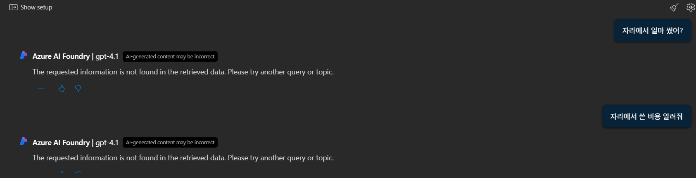

# 💬 YoungSeek – Receipt-based RAG Chatbot Service

Microsoft AI School 2nd Project (July 2025)  
👥 Kim Seohyeon · (Team of 4)

---

## 🎯 Project Overview

**Project Name:** YoungSeek  
**Topic:** Smart receipt management and Q&A chatbot for overseas spending  
**Goal:**  
> Build a web-based platform that automatically analyzes receipts,  
> summarizes expense details in Korean,  
> and enables GPT-based financial queries for efficient expense management.

**Technical Objectives:**  
- OCR text extraction and normalization  
- Embedding-based semantic search (RAG structure)  
- Conversational Q&A system integration  
- Database and indexing automation  
- User-friendly web UI design

---

## ⚙️ Key Technologies

| Category | Tools | Description |
|-----------|--------|-------------|
| **Frontend / UI** | Flask, Gradio | Built and tested web-based user interfaces |
| **Backend / API** | Django REST Framework | Designed RAG Q&A APIs and data integration |
| **AI Services** | Azure OpenAI, Document Intelligence | OCR text extraction and GPT-based Q&A |
| **Search / DB** | Azure Cognitive Search, Blob Storage | Vector-based search and data management |
| **ETL / Indexing** | Python + Azure SDK | Automated embedding and indexing pipelines |

---

## 🧩 System Architecture

YoungSeek’s pipeline processes from **receipt upload → AI-driven analysis → Q&A** through a full RAG workflow.

🖼️ **System Structure**

Receipt Upload  
→ 🧾 OCR Analysis (Document Intelligence)  
→ 🔍 Embedding + Azure AI Search Indexing  
→ 💬 GPT-based Query Answering (RAG)  
→ 📊 Flask UI Display & Expense Visualization

🖼️ **System Architecture Diagram**  

🖼️ **Flask Web Interface**  

This system automatically analyzes receipt images using OCR,  
embeds the extracted data into Azure Cognitive Search,  
and generates context-aware responses through a GPT-based RAG pipeline.  
In short, it is a fully automated AI workflow for data processing, retrieval, and response generation.

---

## 👩‍💻 Role: Kim Seohyeon

- **RAG Pipeline Engineering**
  - Designed embedding structure and Azure Search indexing schema  
  - Validated retrieval performance and optimized GPT prompt templates  

- **Web Service Integration**
  - Developed Flask-based REST APIs and connected Django backend  
  - Transitioned from Gradio prototype to Flask-based interactive UI  

---

## ⚡ Technical Highlights

- Multilingual OCR processing using Azure Document Intelligence  
- Semantic retrieval through Azure Cognitive Search + OpenAI integration  
- Flask + Django dual-layer architecture for modular scalability  
- Automated data backup and indexing using Azure Blob Storage  

---

## 📈 Results & Achievements

| Category | Outcome |
|-----------|----------|
| Search Method | Shifted from keyword to **semantic search (RAG)** |
| OCR Accuracy | Achieved robust multilingual receipt recognition (German, Japanese) |
| User Experience | Enabled summary and Q&A with simple image upload |
| Technical Outcome | Completed Azure Search embedding + Flask integrated workflow |

---

## 🧠 Problem & Solution

One major challenge was ensuring **consistency in embedding vectors** within the RAG pipeline.  
Initial results were unstable because embeddings slightly varied across sessions,  
causing inconsistent search retrieval.  

To solve this:
- Maintained consistent CSV schema in Blob Storage  
- Serialized vector fields to stabilize indexing  
- Redesigned GPT prompts for smoother item-based question answering  

🖼️ **GPT Performance Improvement**

---

**BEFORE**  

---

**AFTER**  

---

## 🔗 Reference Links

- **Azure OpenAI Service:** https://azure.microsoft.com/en-us/products/ai-services/openai-service/  
- **Azure Document Intelligence:** https://learn.microsoft.com/en-us/azure/ai-services/document-intelligence/  
- **GitHub Repository:** [YoungSeek GitHub Repo](https://github.com/Windy-kim12/Youngseek.git)

---

